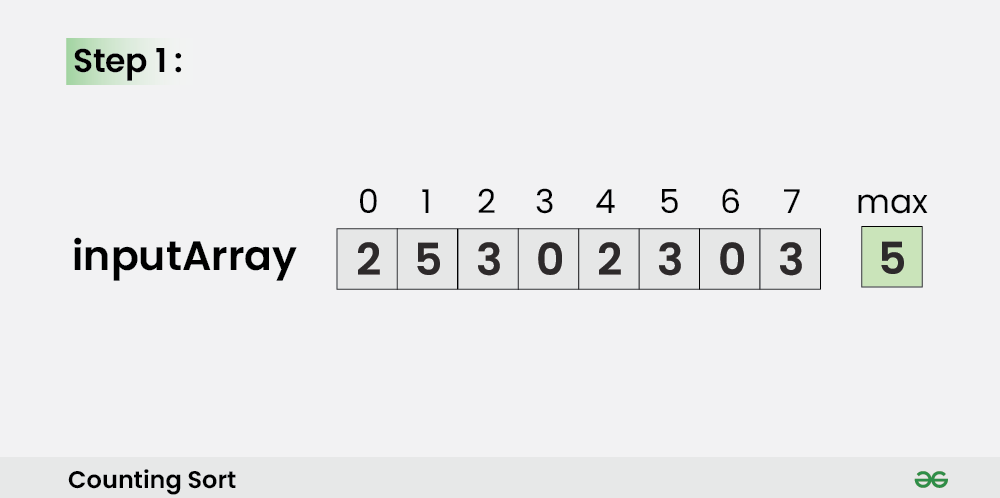
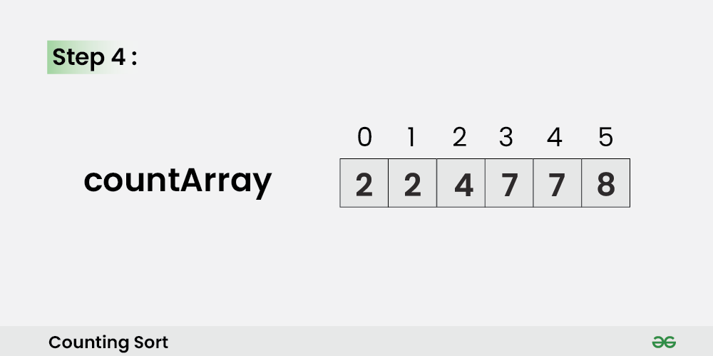
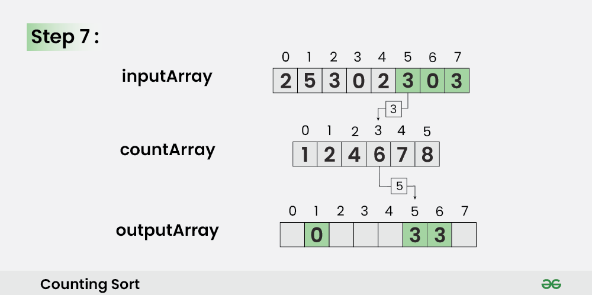

# Count Sort

**Counting Sort** is a **non-comparison-based** sorting algorithm that works well when there is limited range of input values. It is particularly efficient when the range of input values is small compared to the number of elements to be sorted. The basic idea behind **Counting Sort** is to count the **frequency** of each distinct element in the input array and use that information to place the elements in their correct sorted positions.

### How does Counting Sort Algorithm work?

1. Find out the maximum element from the given array. 
    

2. Initialize a `countArray[]` of length `max + 1` with all elements as `0`. This array will be used for storing the occurence of the elements of the input array.
    
3. In the `countArray[]`, store the count of each unique element of the input array at their respective indices.
- **For Example:** The count of element 2 in the input array is 2. So, store 2 at index 2 in the `countArray[]`. Similarly, the count of element 5 in the input array is 1, hence store 1 at index 5 in the `countArray[]`.
    
4. Store the **cumulative sum** or **prefix sum** of the elements of the `countArray[]` by doing `countArray[i] = countArray[i – 1] + countArray[i]`. This will help in placing the elements of the input array at the correct index in the output array.
    
5. Iterate from end of the input array and because traversing input array from end preserves the order of equal elements, which eventually makes this sorting algorithm **stable**.
    - Update `outputArray[ countArray[ inputArray[i] ] – 1] = inputArray[i]`.
    - Also, update `countArray[ inputArray[i] ] = countArray[ inputArray[i] ]--`
    
6. For **i = 6**
    - Update o`utputArray[ countArray[ inputArray[6] ] – 1] = inputArray[6]`
    - Also, update `countArray[ inputArray[6] ] = countArray[ inputArray[6] ]--`
    

7. For **i = 5**
    - Update `outputArray[ countArray[ inputArray[5] ] – 1] = inputArray[5]`
    - Also, `update countArray[ inputArray[5] ] = countArray[ inputArray[5] ]--`
    

8. For **i = 4**
    - Update `outputArray[ countArray[ inputArray[4] ] – 1] = inputArray[4]`
    - Also, `update countArray[ inputArray[4] ] = countArray[ inputArray[4] ]--`
    

9. For **i = 3**
    - Update `outputArray[ countArray[ inputArray[3] ] – 1] = inputArray[3]`
    - Also, `update countArray[ inputArray[3] ] = countArray[ inputArray[3] ]--`
    

10. For **i = 2**
    - Update `outputArray[ countArray[ inputArray[2] ] – 1] = inputArray[2]`
    - Also, `update countArray[ inputArray[2] ] = countArray[ inputArray[2] ]--`
    

11. For **i = 1**
    - Update `outputArray[ countArray[ inputArray[1] ] – 1] = inputArray[1]`
    - Also, `update countArray[ inputArray[1] ] = countArray[ inputArray[1] ]--`
    

12. For **i = 0**
    - Update `outputArray[ countArray[ inputArray[0] ] – 1] = inputArray[0]`
    - Also, `update countArray[ inputArray[0] ] = countArray[ inputArray[0] ]--`
     

### Counting Sort Algorithm:
- Declare an auxiliary array **countArray[]** of size **max(inputArray[])+1** and initialize it with **0**.
- Traverse array **inputArray[]** and map each element of **inputArray[]** as an index of countArray[] array, i.e., execute **countArray[inputArray[i]]++** for **0 <= i < N**.
- Calculate the prefix sum at every index of array **inputArray[]**.
- Create an array **outputArray[]** of size N.
- Traverse array **inputArray[]** from end and update ****outputArray[ countArray[ inputArray[i] ] – 1] = inputArray[i]**. Also, update countArray[ inputArray[i] ] = countArray[ inputArray[i] ]--** .

``` js
const countSort = (nums) => {
  let max = -Infinity
  
  for (const num of nums)
    if (num > max) max = num

  const countArray = new Array(max + 1).fill(0)
  
  for (const num of nums)
    countArray[num]++
    
  for (let i = 1; i <= max; i++)
    countArray[i] += countArray[i - 1]
  
  const sortNums = new Array(nums.length)
  
  for (let i = max; i >= 0; i--) {
    sortNums[countArray[nums[i]] - 1] = nums[i]
    countArray[nums[i]]--
  }
    
  return sortNums
}

const inputArray = [4, 3, 12, 1, 5, 5, 3, 9]
const outputArray = countSort(inputArray)

console.log(outputArray.join(', '))
```

### Complexity Analysis of Counting Sort:
- **Time Complexity:** **O(N+M)**, where **N** and **M** are the size of **inputArray[]** and **countArray[]** respectively.
    - Worst-case: **O(N+M)**.
    - Average-case: **O(N+M)**.
    - Best-case: **O(N+M)**.

- Auxiliary Space: **O(N+M)**, where **N** and **M** are the space taken by **outputArray[]** and **countArray[]** respectively.

### Advantage of Counting Sort:
- Counting sort generally performs faster than all comparison-based sorting algorithms, such as merge sort and quicksort, if the range of input is of the order of the number of input.
- Counting sort is easy to code
- Counting sort is a stable algorithm.

### Disadvantage of Counting Sort:
- Counting sort doesn’t work on decimal values.
- Counting sort is inefficient if the range of values to be sorted is very large.
- Counting sort is not an In-place sorting algorithm, It uses extra space for sorting the array elements.
