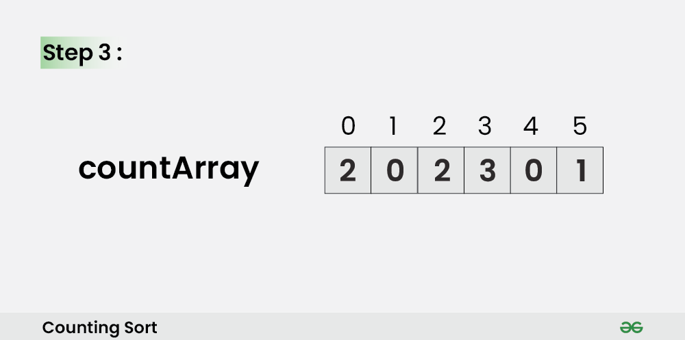

# Count Sort

**Counting Sort** is a **non-comparison-based** sorting algorithm that works well when there is limited range of input values. It is particularly efficient when the range of input values is small compared to the number of elements to be sorted. The basic idea behind **Counting Sort** is to count the **frequency** of each distinct element in the input array and use that information to place the elements in their correct sorted positions.

### How does Counting Sort Algorithm work?

1. Find out the maximum element from the given array. 
    

2. Initialize a `countArray[]` of length `max + 1` with all elements as `0`. This array will be used for storing the occurence of the elements of the input array.
    
3. In the `countArray[]`, store the count of each unique element of the input array at their respective indices.
- **For Example:** The count of element 2 in the input array is 2. So, store 2 at index 2 in the `countArray[]`. Similarly, the count of element 5 in the input array is 1, hence store 1 at index 5 in the `countArray[]`.
    
4. Store the **cumulative sum** or **prefix sum** of the elements of the `countArray[]` by doing `countArray[i] = countArray[i – 1] + countArray[i]`. This will help in placing the elements of the input array at the correct index in the output array.
    
5. Iterate from end of the input array and because traversing input array from end preserves the order of equal elements, which eventually makes this sorting algorithm **stable**.
    - Update `outputArray[ countArray[ inputArray[i] ] – 1] = inputArray[i]`.
    - Also, update `countArray[ inputArray[i] ] = countArray[ inputArray[i] ]--`
    